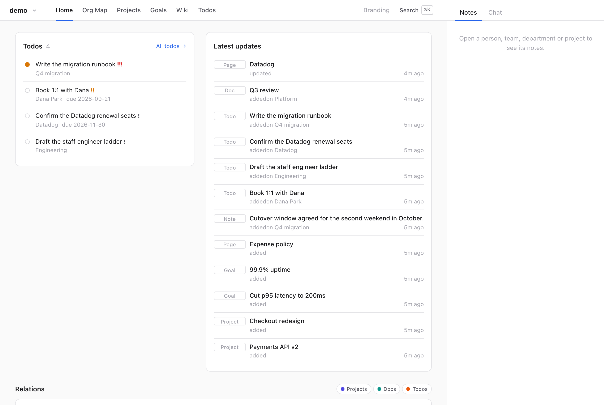
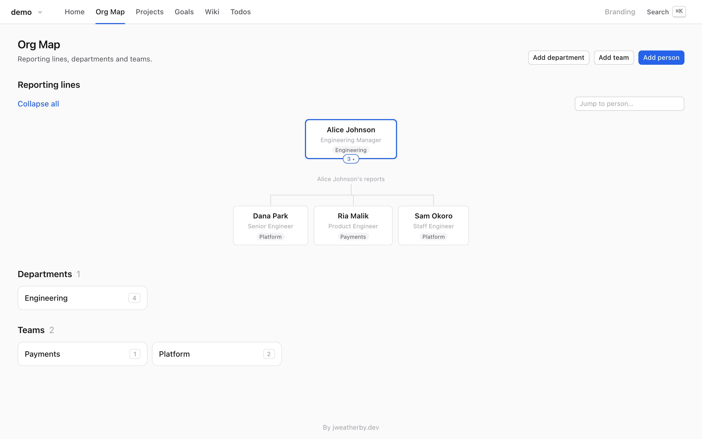
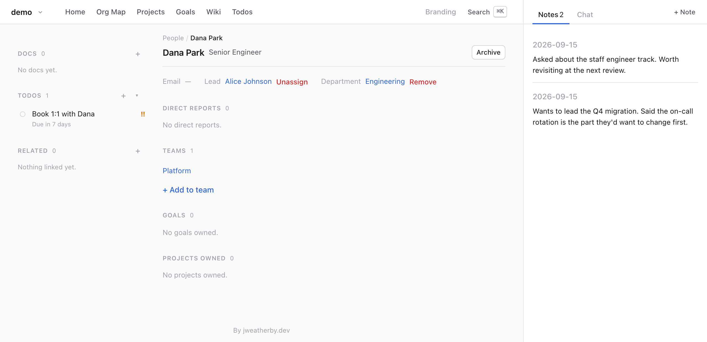
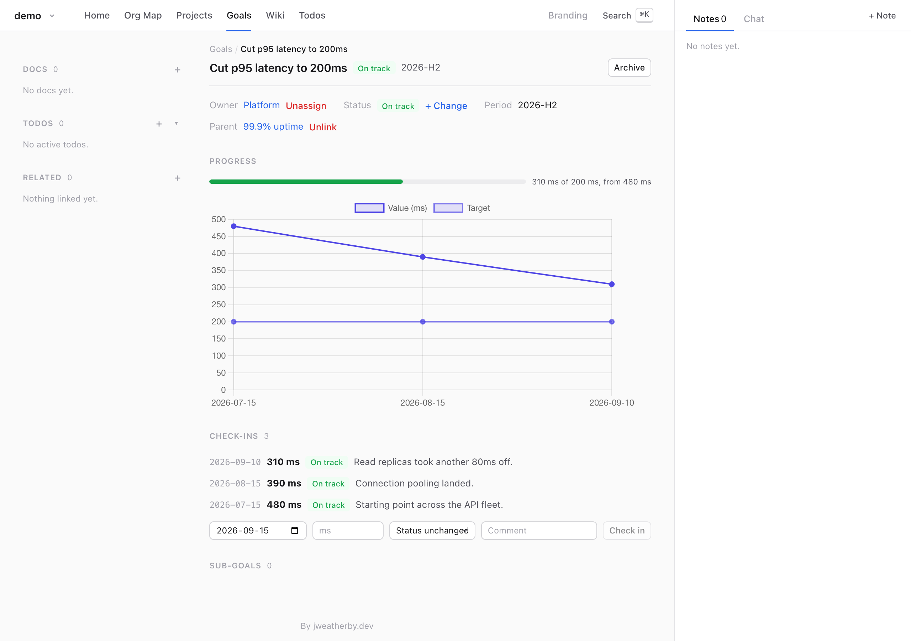
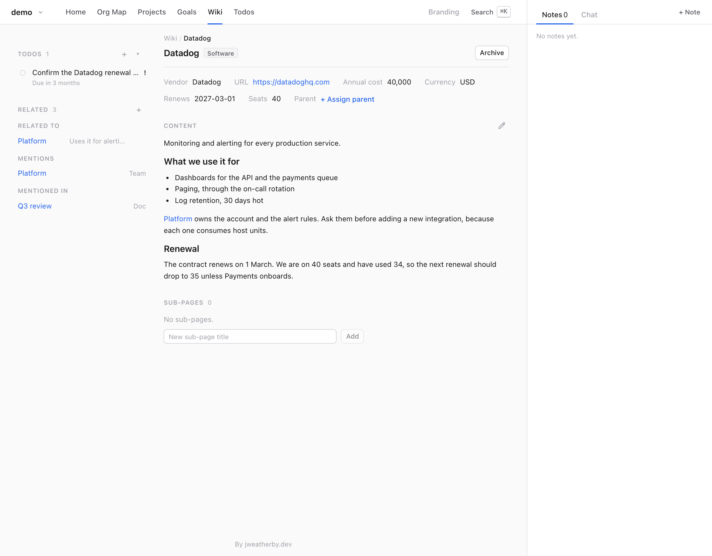
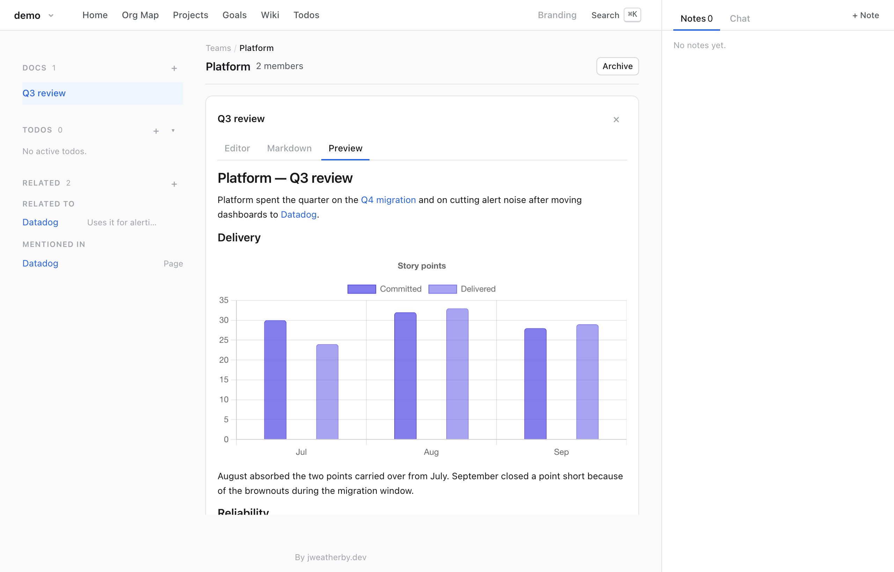

# Remry

A local, structured notebook that your AI assistant writes to over MCP. Works with Claude today.

Remry remembers what you would otherwise carry in your head: who reports to whom, which team
owns which project, where a goal stands this month, why you chose that vendor, what you promised to
follow up on. It keeps them exactly as you said them, for as long as you need them.

You put things in by telling Claude. Claude looks them up when you ask, and you read them in an app
on your own Mac.



## What you can use it for

- **Running a team.** Who reports to whom, who sits on which team, what you agreed in the last 1:1,
  who is ready for more.
- **Keeping track of the work.** Projects, who owns them, what blocks what, and what you said you
  would do next.
- **Goals with real numbers.** A target, a figure each month, and a chart of how it actually went.
- **Remembering decisions.** Why you bought that tool, what it costs, when it renews, which policy
  applies.
- **Writing it up.** A quarter in review, a career plan, a summary for your boss — built from what
  is already there.

## How it works

**You talk, Claude files.** Say "Dana moved from Platform to Payments" and Claude makes the change.
There is no form to fill in, and the app does not need to be open.

**It does not forget.** What you tell it is stored, not summarised into a memory that fades or
blurs. A note from March reads the same in September, and Claude looks it up rather than trying to
recall it.

**It keeps the shape of things.** A person has a manager. A project has an owner. A goal has
check-ins with dates and values. That is what lets you ask "what do I know about Dana?" or "what
depends on the payments API?" and get an answer instead of a search result — the same answer
each time.

**Nothing leaves your Mac.** No accounts, no keys, no sync, nothing sent anywhere. The app itself
never calls a language model — Claude works on it from outside. That matters when the notes are
about people.

**It sits beside your other tools.** Linear, Notion and the rest hold the team's version of things;
Remry holds yours.
Ask Claude to bring a project or page in and it copies only the parts that matter to you, links back
to the source, and updates the same entry next time instead of making a second one. Your own notes
and opinions stay yours.

**Work and side projects stay apart.** Each notebook is separate, and nothing links across them.

## What using it looks like

### An org change

> **You:** Dana Park joined as a senior engineer, on Platform, reporting to Alice.

Claude adds Dana, sets the reporting line, and puts her on the team.



You can edit the org map by hand as well. Redrawing a reorganisation is the one job that is quicker
that way.

### After a 1:1

> **You:** Note that Dana wants to lead the migration — she'd change the on-call rotation first.
> Remind me to book a 1:1.

The note goes on Dana's page in your words, with the date. The reminder becomes a todo.



Ask "what do I know about Dana?" months later and Claude reads back her notes, todos, docs and
goals.

### A goal you check in on

> **You:** Platform's H2 goal is p95 latency under 200ms, from 480. We're at 310 now — read replicas
> took another 80ms off.

Each check-in adds to a timeline instead of overwriting a number, so the chart is the history.
The period is read as dates: `2026-H2` is July to December, so the page shows how much of it has
gone by, the chart draws the pace you would need, and a goal that trails it is flagged "Behind
pace". The flag is a hint; it never changes the goal's status.



### A wiki that links up

> **You:** We pay Datadog $40k a year for 40 seats; it renews in March. Platform uses it for
> alerting.

Pages come in kinds. A software page takes a vendor, a cost and a renewal date; a policy page takes
a version and an effective date. Remry turns away anything else, so pages of the same kind
stay comparable.



Anything can link to anything — related, or one depends on the other — todos included. Mention a
project inside a page and the project gains a "Mentioned in" entry by itself.

### Writing it up

> **You:** Write up Platform's quarter as a doc — delivery and reliability, with charts.

Docs are markdown, and a doc can hold charts drawn from figures you give Claude.



Paste or drop an image into a doc and it is stored with the notebook. Any doc or wiki page exports
to PDF, with your branding's letterhead or without.

## The app

The app is mostly for reading, usually in a browser pane beside Claude. You can install it on your
Mac so that it gets a Dock icon and a window of its own — see
[docs/INSTALL.md](docs/INSTALL.md#install-it-as-a-mac-app).

The home screen shows your open todos, what changed lately, and a graph with one thing in the
middle and everything linked to it around it; click a neighbour to move there. The org map shows
reporting lines, or switch it to **Work** for each owner's projects and goals and the arrows between
them. The projects page has a **Map** view that lays projects out by what depends on what, with the
goals they deliver. Everything else gets a page of its own, with its docs down the middle, its todos,
related things and links in the sidebar and its notes on the right. A link to Linear, Notion, GitHub
or another tool shows the tool's mark, and when Claude last synced the page from it.

Press ⌘K to search. Start with `/` to look in one place only, as in `/person dana`.

Every page has a **Chat** tab for asking about what is on screen. It runs your own copy of Claude,
and keeps each page's conversation in the notebook until you clear it or delete the page.

Nothing is lost by accident. Archiving keeps a thing and its history but takes it out of every list.
Deleting takes its notes and todos with it, so Claude offers to archive first.

## Backups

Remry copies each notebook every hour, but only when something changed. Restoring saves your
current data first, so you can undo it.

```bash
remry backup install
```

Copies stay on this disk, so they will not save you from losing the disk. Time Machine will, and it
covers them for you.

## How is this different from…

**…your assistant's own memory?** It decides for itself what to keep, and summarises it. Working
Notes keeps exactly what you said, where you can see it, and your assistant looks it up instead of
recalling it.

**…a memory server, like the reference knowledge-graph server or Basic Memory?** Those store free
text and links: anything can be anything. Remry knows what a person, a team, a project and
a goal are. A goal has a period and dated check-ins, a todo has a status and a due date, and it
turns away input that doesn't fit. That is what lets it answer "which goals are behind pace?"
instead of searching for the word "goal". It also comes with an app to read it in.

**…Obsidian, Notion or Apple Notes, with an assistant connected?** Those are pages you organise
yourself. Here you don't organise anything: you say what happened, and it is filed in the right
place.

**…Linear, Notion or Lattice for the team?** Those hold the team's version of things, and others
can see them. Remry holds yours, privately, and can link back to them.

## Getting started

- **[docs/INSTALL.md](docs/INSTALL.md)** — install it for Claude Code, Cowork or the Claude desktop
  app. A release brings the app with it, so there is nothing else to install.
- **[docs/CLI.md](docs/CLI.md)** — the `remry` command and the tools Claude uses, for when you want
  to drive it yourself.
- **[docs/DEVELOPMENT.md](docs/DEVELOPMENT.md)** — running from a clone, and how releases work.

## Status

Remry is one person's tool, built in the open. Expect it to change. It was called Wonos, and
Working Notes before that; [docs/INSTALL.md](docs/INSTALL.md#coming-from-wonos-or-working-notes) covers moving over.

Reports — branded write-ups printed to PDF — are built but switched off while they are unfinished.
Write-ups go in docs instead.

Branding, PDF export and full-text search are part of Remry Pro, a yearly license that the
app checks on your computer without contacting anything. Everything else is free.

Releases are built for Apple silicon Macs, with Windows and Linux builds in preview, and a desktop
app for all three is on the way. On Windows, connecting Claude needs one extra step for now; see
[docs/INSTALL.md](docs/INSTALL.md).
